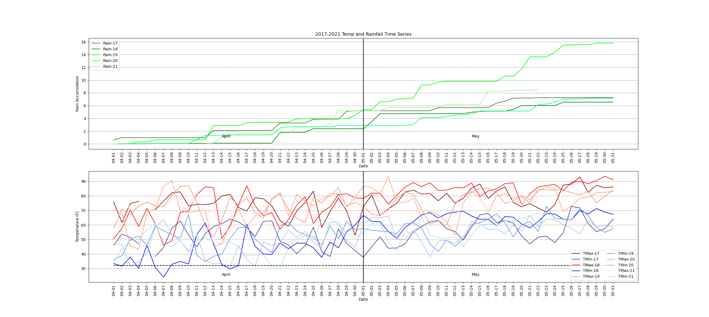

# mesonet
Python plots, to plot Oklahoma Mesonet data

1. Clone repo: 

<code>git clone git@github.com:tiffanycmeyer13/mesonet.git</code>

2. Download data: http://www.mesonet.org/index.php/weather/daily_data_retrieval

    * Stations:	NRMN
    * Parms:	TMAX TMIN DMAX DMIN HMAX HMIN PDIR WSMX WSMN RAIN

    * Download file, unzip it

        * vi file, find and replace "
        
        <code> %s/"//g </code>
        
        <code> set ff=unix </code>

3. Enable conda environment

<code>cd mesonet</code>

<code>~/anaconda/bin/conda env create -f mesonet.yml</code>

<code>~/anaconda3/bin/conda init bash</code>

<code>~/anacondarbin/conda activate mesonet</code>

Use this for picking colors
https://matplotlib.org/stable/gallery/color/named_colors.html
